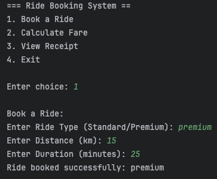
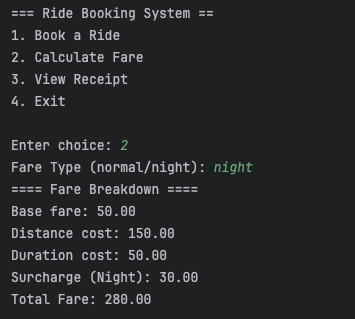
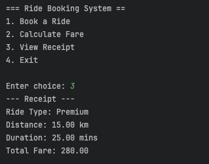
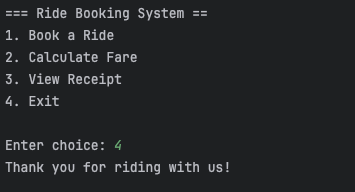

# Group 15: Ride Fare Calculator
## Members
1. Gideon Antony Salangsang
2. Earl John Pulido
3. Luis Maverick Gabriel
## Output

## Description
Ride Fare Calculator is a Java console application that allows users to:
- Book a ride by selecting vehicle type (Standard or Premium)
- Compute fare dynamically based on distance, duration, and surcharges
- Apply different fare strategies (Normal and Night) using the Strategy Pattern
- Generate and display a detailed receipt
- Ensure modularity and scalability with the Factory Pattern

### Booking a ride

### Calculating Fare

### Printing Receipt

### Exiting
